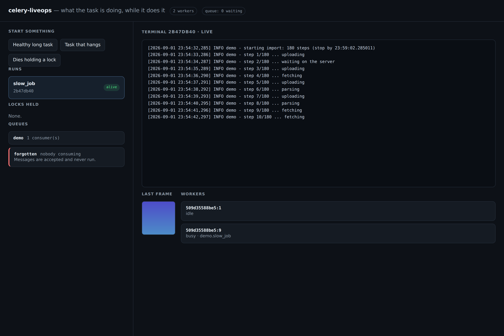
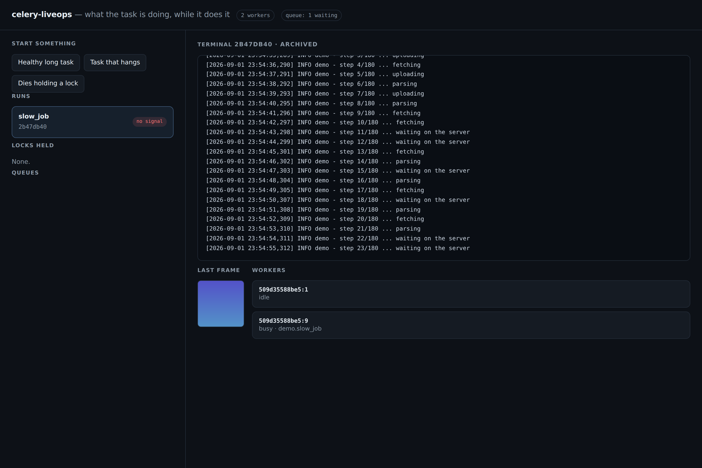
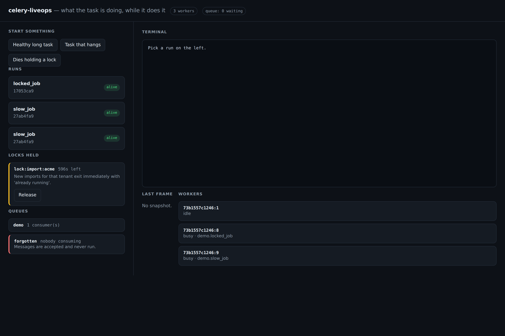

# celery-liveops

[](https://github.com/joaopalmeidao/celery-liveops/actions/workflows/ci.yml)
[](https://github.com/joaopalmeidao/celery-liveops/actions/workflows/demo.yml)
[](https://pypi.org/project/celery-liveops/)
[](https://pypi.org/project/celery-liveops/)
[](LICENSE)

**See inside a long-running Celery task while it runs.**

A task that takes eight hours is a black box. The result backend tells you what
happened *after* it happened. Flower tells you a task is running — not what it is
doing, not whether the process behind it is still breathing, and not why the next
one exits instantly with "already running".

`celery-liveops` is the small set of pieces that answer those questions. They
come from a production system running headless-browser automations: hundreds of
runs a day, from 15-second jobs to overnight sweeps, on workers that must be
restarted without losing evidence.

```python
from celery_liveops import install, capture_logs

install(watchdog={"crawl": 3600}, watchdog_enabled=True)

@app.task(bind=True)
def crawl(self, url):
    with capture_logs(self.request.id):
        log.info("fetching %s", url)      # readable live, from your API process
```

```python
from celery_liveops import read_any_logs, is_alive

read_any_logs(task_id)   # the terminal — live, or the archived previous attempt
is_alive(task_id)        # ...or is this "running" row an orphan?
```

---

## What is in the box

| Module | Answers |
|---|---|
| **logs** | What is this task printing *right now*? And what did the attempt that died print? |
| **presence** | Does this "running" row still have a living process behind it? Which workers are up? |
| **watchdog** | A hard deadline **per task**, not per container — so one pool serves a 15-minute job and an 8-hour one. |
| **locks** | Which Redis locks did a dead process leave behind, and who can safely release them? |
| **queues** | Queue depth, who consumes what, and the declared queue **nobody** is consuming. |
| **scale** | Resize a running worker; make that size survive a restart. |
| **snapshots** | A live frame of what a browser task is looking at. |

One rule runs through all of it: **observability must never break the job it is
observing.** Every Redis call is wrapped, every failure degrades the panel rather
than the work. A Redis outage greys out a badge; it does not fail a task.

---

## Install

```bash
pip install celery-liveops              # core (redis)
pip install "celery-liveops[celery]"    # + signal wiring
pip install "celery-liveops[fastapi]"   # + the ready-made router
```

Python 3.9+. Redis 5+. Celery is optional — importing this in a web-only process
is harmless.

---

## The five things it does

### 1. Live logs, across process boundaries

The worker writes, your API reads, and they are in different containers. The
transport is a capped Redis list (`RPUSH` + `LTRIM`) — exactly the shape a
scrolling terminal wants.

```python
install_logging(logging.getLogger("myapp"))   # one handler, once

with capture_logs(task_id):
    ...                    # every log line in this block is captured
```

The handler is a **cheap no-op outside a run**, so the same logging setup serves
your API, your beat process and your workers.

**The part worth stealing:** Celery keeps the task id across retries. When a
process dies without running its `finally` — OOM, a watchdog, a deploy mid-run —
that attempt's log exists nowhere but Redis, and the next attempt used to start
by deleting it. Here it is *renamed* instead:

```python
read_orphan_logs(task_id)   # what the attempt that died was doing
```

Your reaper can archive that against the failed run before closing it. The only
evidence of the crash survives the retry.

### 2. Presence — is anybody home?

```python
is_alive(task_id)              # one run
alive_among(page_of_task_ids)  # a whole table, one round trip
workers()                      # every worker heartbeating right now
```

Written from Celery's `task_prerun`/`task_postrun` signals plus a daemon thread
that refreshes while the task runs. Readers only ever do `EXISTS` — no
`celery inspect`, which is slow and times out precisely when you need it, in an
endpoint being polled every three seconds. Every key has a TTL, so a dying
process cleans up after itself.

### 3. A deadline that belongs to the task

Celery enforces `task_time_limit` by killing the *child* process of a prefork
pool. With `--pool=solo` there is no child, so it never fires: a worker stuck on
one task holds its queue until somebody restarts it by hand.

```python
install_watchdog(
    deadlines={"quick.petition": 900, "overnight.sweep": 28800},
    enabled=True,
)
```

When the timeout is an environment variable it is a property of the *container*,
and every duration profile needs its own service — a pool of identical replicas
can never serve both, because the long run dies halfway through in the short
container. Registered per task name, one fungible pool serves every profile.

Cooperative stopping is better whenever the task can manage it:

```python
stop_by = safe_stop_at(task_name="crawl")     # 90% of the budget
for page in pages:
    if datetime.now() >= stop_by:
        save_checkpoint(page)                  # stop clean, resume later
        break
```

The watchdog is off unless you turn it on. A library that kills processes has to
be opted into, never switched on by the act of installing it.

### 4. The locks a dead process left behind

A key taken to serialise work that is not reentrant — one login per account, one
scrape per catalogue — is released in a `finally`. When the process never reaches
that `finally`, the key stays and keeps blocking new work until its TTL expires.

The symptom is miserable: nothing shows an error. The trigger "works", the task
exits with "already running", the screen says nothing.

```python
register_lock(
    pattern="lock:login:*",
    label="Login (one session per account)",
    blocks="Other runs on the same account queue behind the login.",
)

list_locks()                      # what is held, and for how long
release_locks(["lock:login:42"])  # allowlist-checked
lock_state("lock:login:42")       # why this click will not run anything
```

Two guarantees: **only registered patterns can be released** (the raw key
arrives from a browser — without the allowlist, an arbitrary `DEL` against
production Redis is one POST away), and **no guessing** — automatic release is
limited to singleton locks that unambiguously belong to the run being killed,
because freeing a *live* run's lock is worse than the problem.

### 5. The queue nobody is consuming

The quietest failure a Celery deployment has: the message is published, the
enqueue returns success, the screen says "queued" — and nothing ever runs it,
forever. It happens the day a service is commented out of the compose file.

```python
orphan_queues()          # declared, but nobody consuming
queue_depth("fast")      # None means "could not ask" — NOT zero
has_consumer("fast")     # True when it cannot tell — fail-fast callers
```

Those two failure modes point in opposite directions on purpose. A reaper
deciding whether a pending item was abandoned must distinguish "the queue is
empty" from "I could not ask", or it invents failures that never happened. A
caller checking before it enqueues would rather wait than refuse real work
because the broker was slow.

---

## The panel, in one line

```python
from fastapi import Depends, FastAPI
from celery_liveops.contrib.fastapi import liveops_router

app.include_router(liveops_router(dependencies=[Depends(require_operator)]))
```

`GET /liveops/runs/{id}/logs`, `/snapshot`, `POST /runs/alive`, `GET /workers`,
`/locks`, `POST /locks/release`, `GET /queues`.

It exposes task output, screenshots and a lock release, so it **refuses to be
mounted** without either `dependencies=[...]` or an explicit `public=True`.

---

## Try it

A working stack — Redis, RabbitMQ, a worker, a FastAPI panel — is in
[`demo/`](demo/). In the browser, no install:

[](https://codespaces.new/joaopalmeidao/celery-liveops)

Or locally:

```bash
docker compose -f demo/docker-compose.yml up --build
# open http://localhost:8000
```

Start a task, watch its terminal stream, kill the worker mid-run and watch the
row go from *alive* to *no signal* while the orphan log survives.

### These screenshots are generated, not staged

The [Demo workflow](.github/workflows/demo.yml) builds the stack on every change,
starts real work, **stops the worker container mid-run** and captures the panel.
So it is a test as much as a picture: if presence, the live buffer or the lock
catalogue break, it fails — which the unit suite cannot claim, running as it does
against `fakeredis`.

| A task streaming | Its worker stopped | The lock it left behind |
|---|---|---|
|  |  |  |

Reproduce it yourself against a running stack:

```bash
pip install playwright httpx && playwright install chromium
python demo/capture.py --out-dir docs/screenshots
```

---

## Configuration

Everything has a working default; nothing needs configuring to try it.

```python
configure(redis_url="redis://cache:6379/2", key_prefix="billing", max_lines=500)
configure(redis_client=my_existing_client)   # bring your own connection
```

Or by environment: `LIVEOPS_REDIS_URL`, `LIVEOPS_KEY_PREFIX`, `LIVEOPS_MAX_LINES`,
`LIVEOPS_LOG_TTL`, `LIVEOPS_PRESENCE_TTL`, `LIVEOPS_WATCHDOG_ENABLED`,
`LIVEOPS_DEFAULT_DEADLINE`, `LIVEOPS_SNAPSHOT_TTL`, `LIVEOPS_MAX_CONCURRENCY`.

See [`docs/design-notes.md`](docs/design-notes.md) for the reasoning behind the
less obvious choices.

---

## Development

```bash
uv venv && uv pip install -e ".[dev]"
uv run pytest
uv run ruff check .
```

## License

MIT
